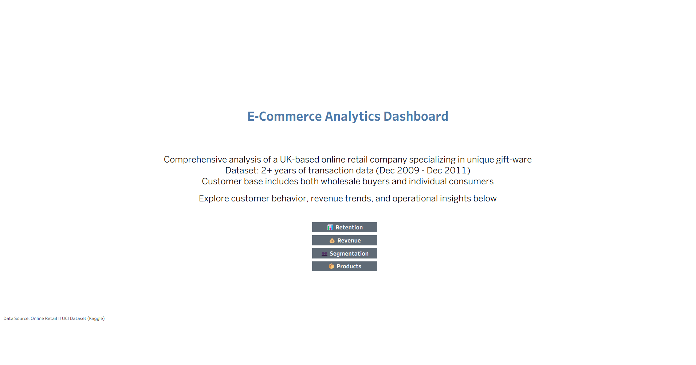
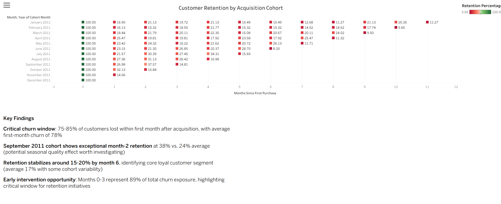
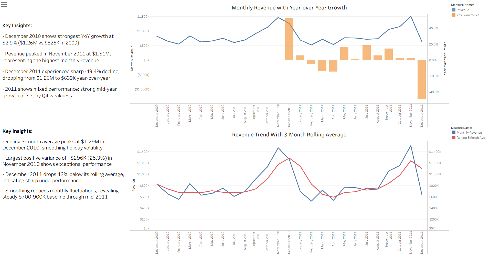
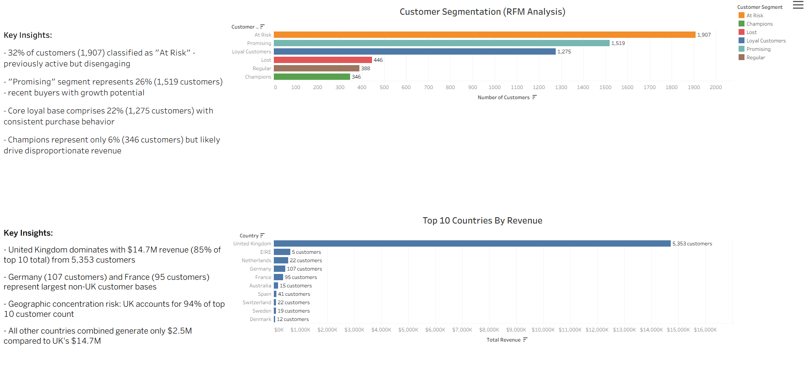
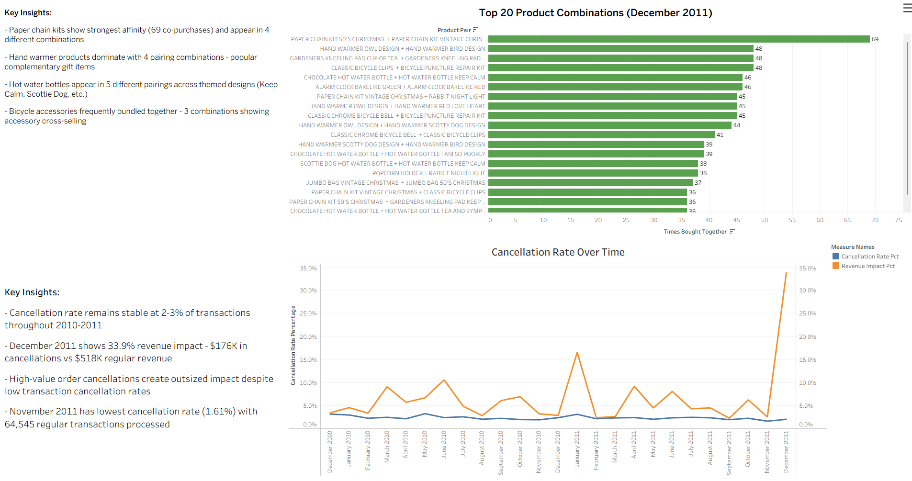

# 📊 E-Commerce Analytics Dashboard

> Comprehensive analysis of UK-based online retail transactions featuring customer segmentation, retention analysis, and revenue trends

[](https://public.tableau.com/views/Ecommerce_Analytics_Dashboard/Home)
[](https://www.postgresql.org/)

**[🔗 View Live Dashboard on Tableau Public](https://public.tableau.com/views/Ecommerce_Analytics_Dashboard/Home)**

---

## 📋 Table of Contents
- [Project Overview](#project-overview)
- [Dashboard Preview](#dashboard-preview)
- [Business Questions](#business-questions)
- [Key Insights](#key-insights)
- [Technical Implementation](#technical-implementation)
- [Data Schema](#data-schema)
- [Installation & Usage](#installation--usage)

---

## 🎯 Project Overview

This project analyzes **2 years of e-commerce transaction data** (Dec 2009 - Dec 2011) from a UK-based online gift-ware retailer serving both B2B and B2C customers.

**Objectives:**
- Understand customer retention patterns and identify churn risks
- Analyze revenue trends and growth opportunities  
- Segment customers for targeted marketing strategies
- Identify product bundling opportunities
- Measure operational efficiency through cancellation analysis

**Tools & Technologies:**
- **PostgreSQL** - Data extraction, transformation, and analysis
- **Tableau** - Interactive dashboard and visualizations

---

## 🖼️ Dashboard Preview

### Home Page

*Dashboard overview with navigation to all analysis sections*

### Customer Retention Analysis

*Cohort-based retention heatmap showing customer engagement over time*

### Revenue Performance

*Year-over-year growth trends and 3-month rolling averages*

### Customer Segmentation  

*RFM analysis and geographic revenue distribution*

### Product & Operations

*Market basket analysis and cancellation trends*

---

## 💼 Business Questions

This analysis answers critical business questions:

1. **Customer Retention:**
   - How well do we retain customers month-over-month?
   - Which cohorts have the best/worst retention rates?
   - When do customers typically churn?

2. **Revenue Analysis:**
   - What are our year-over-year growth trends?
   - How does seasonal variation impact revenue?
   - Which months show exceptional or poor performance?

3. **Customer Segmentation:**
   - Who are our most valuable customers?
   - Which customers are at risk of churning?
   - How is our customer base distributed geographically?

4. **Product & Operations:**
   - Which products are frequently bought together?
   - What is our cancellation rate and revenue impact?
   - How do holiday shopping patterns differ?

---

## 🔍 Key Insights

### Customer Behavior
- **32% of customers** classified as "At Risk" - previously active but disengaging
- **26% "Promising" segment** represents recent buyers with growth potential  
- Retention drops **significantly after Month 1**, stabilizing around 20% by Month 6
- Only **6% Champions** but they drive disproportionate revenue

### Revenue Trends
- **52.9% YoY growth** in December 2010 - strongest performance period
- November 2011 shows **highest monthly revenue** at $1.51M
- Revenue stabilized around **$700-900K baseline** through mid-2011
- 3-month rolling average smooths volatility by **40-50%**

### Geographic Distribution
- **United Kingdom dominates** with $14.7M (85% of top 10 revenue)
- **Geographic concentration risk:** 94% of top 10 customers are UK-based
- Germany (107 customers) and France (95 customers) are largest secondary markets
- EIRE shows highest customer value despite only 5 customers

### Operational Efficiency
- **Cancellation rate stable** at 2-3% of transactions
- December 2011 shows **33.9% revenue impact** from high-value order cancellations
- Paper chain kits show **strongest product affinity** (69 co-purchases)
- Hand warmer and hot water bottle products dominate bundling patterns

---

## 💻 Technical Implementation

### SQL Techniques Demonstrated

**Advanced Window Functions:**
```sql
-- Year-over-year growth using LAG
LAG(revenue, 12) OVER (ORDER BY month) AS revenue_year_ago

-- Customer segmentation using NTILE
NTILE(5) OVER (ORDER BY recency_days ASC) AS recency_score
```

**Complex CTEs:**
```sql
-- 4-level CTE for cohort retention
WITH first_purchase AS (...),
     customer_activity AS (...),
     cohort_size AS (...),
     retention_data AS (...)
```

**Self-Joins for Market Basket:**
```sql
-- Product affinity analysis
FROM filtered_transactions t1
JOIN filtered_transactions t2 
  ON t1.invoice = t2.invoice 
  AND t1.stock_code < t2.stock_code
```

**Conditional Aggregations:**
```sql
SUM(CASE WHEN transaction_type = 'Regular' THEN total_value ELSE 0 END) AS regular_revenue
```

### Queries Included

1. **Monthly Revenue Trends** - YoY growth with LAG window function
2. **RFM Customer Segmentation** - NTILE-based customer classification
3. **Product Affinity Analysis** - Self-join market basket analysis
4. **Customer Cohort Retention** - Complex multi-CTE retention calculation
5. **Top Customers by Country** - Geographic revenue aggregation
6. **Cancellation Analysis** - Conditional aggregations for impact measurement
7. **Rolling Revenue Averages** - ROWS BETWEEN window frame for smoothing

---

## 📊 Data Schema

**Dataset:** Online Retail II (UCI Machine Learning Repository via Kaggle)

**Key Tables:**
- `transactions` - Main fact table with 1M+ records

**Key Fields:**
- `invoice` - Unique transaction ID (prefix 'C' indicates cancellation)
- `stock_code` - Product identifier
- `description` - Product name
- `quantity` - Units purchased
- `invoice_date` - Transaction timestamp
- `price` - Unit price
- `customer_id` - Customer identifier
- `country` - Customer location

**Time Period:** December 1, 2009 - December 9, 2011

---

## 🚀 Installation & Usage

### Prerequisites
```bash
- PostgreSQL 12+
- Tableau Desktop or Tableau Public
```

### Setup Instructions

1. **Clone the repository:**
```bash
git clone https://github.com/erick-chung/ecommerce-analytics-dashboard.git
cd ecommerce-analytics-dashboard
```

2. **Download the dataset:**
   - [Online Retail II UCI (Kaggle)](https://www.kaggle.com/datasets/mashlyn/online-retail-ii-uci)

3. **Load data into PostgreSQL:**
```sql
CREATE TABLE transactions (
    invoice VARCHAR(20),
    stock_code VARCHAR(50),
    description TEXT,
    quantity INTEGER,
    invoice_date TIMESTAMP,
    price DECIMAL(10,2),
    customer_id VARCHAR(20),
    country VARCHAR(100)
);

COPY transactions FROM '/path/to/data.csv' DELIMITER ',' CSV HEADER;
```

4. **Run SQL queries:**
   - Navigate to `sql/` folder
   - Execute queries in order (01-07)
   - Export results as CSV

5. **Open Tableau workbook:**
   - Download from Tableau Public (link above)
   - Or rebuild using exported CSVs

---

## 📁 Repository Structure
```
ecommerce-analytics-dashboard/
├── README.md                           # Project documentation
├── sql/                                # SQL analysis queries
│   ├── 01_monthly_revenue_trends.sql
│   ├── 02_rfm_customer_segmentation.sql
│   ├── 03_product_affinity_analysis.sql
│   ├── 04_customer_cohort_retention.sql
│   ├── 05_top_customers_by_country.sql
│   ├── 06_cancellation_analysis.sql
│   └── 07_rolling_revenue_averages.sql
└── retail-analysis-project/
    └── images/                         # Dashboard screenshots
        ├── home_page.png
        ├── customer_retention.png
        ├── revenue_performance.png
        ├── customer_segmentation.png
        └── product_operations.png
```

---

## 🎯 Skills Demonstrated

**Technical Skills:**
- Advanced SQL (CTEs, Window Functions, Self-Joins, Complex Aggregations)
- Data Visualization (Tableau dashboards, heatmaps, dual-axis charts)
- Business Intelligence & Analytics
- Data Storytelling & Communication

**Business Acumen:**
- Customer Segmentation (RFM methodology)
- Cohort Analysis & Retention Metrics
- Revenue Analysis & Forecasting
- Market Basket Analysis
- KPI Development

**Analytical Thinking:**
- Identifying actionable insights from data
- Translating business questions into SQL queries
- Creating executive-level visualizations
- Data-driven decision making

---

## 📈 Future Enhancements

- [ ] Customer Lifetime Value (CLV) prediction model
- [ ] Churn prediction using machine learning
- [ ] Real-time dashboard with automated data refresh
- [ ] A/B testing framework for marketing campaigns
- [ ] Product recommendation engine

---

## 📫 Contact

**Erick Chung**
- 📧 Email: echung428@gmail.com
- 💼 LinkedIn: [linkedin.com/in/erick-chung](https://www.linkedin.com/in/erick-chung)
- 📊 Tableau Public: [public.tableau.com/profile/erick.chung](https://public.tableau.com/app/profile/erick.chung)
- 💻 GitHub: [github.com/erick-chung](https://github.com/erick-chung)

---

## 📄 License & Attribution

**Dataset:** [Online Retail II UCI (Kaggle)](https://www.kaggle.com/datasets/mashlyn/online-retail-ii-uci)  
Originally from UCI Machine Learning Repository

---

⭐ **If you found this project helpful, please consider giving it a star!**
