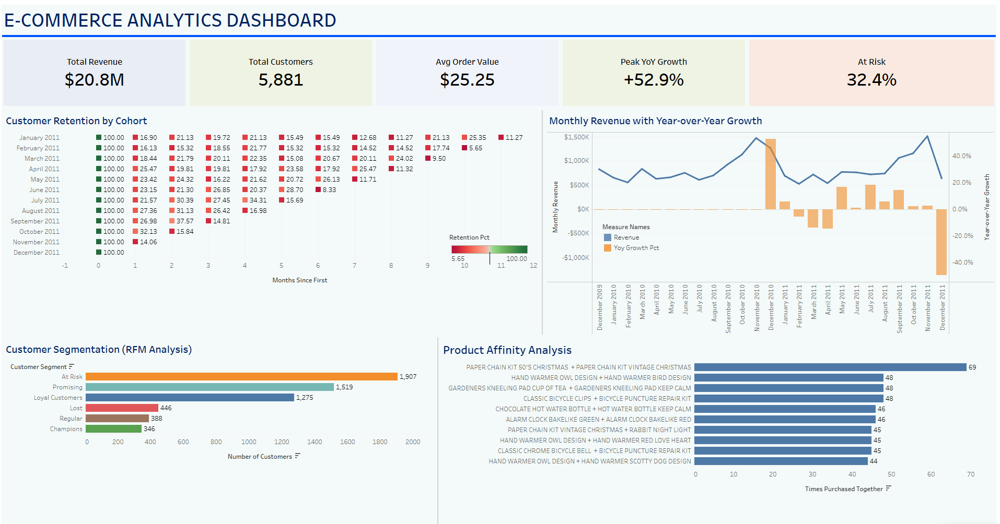

# 📊 E-Commerce Analytics Dashboard

Comprehensive single-page analytics dashboard analyzing UK-based online retail transactions featuring customer retention, RFM segmentation, revenue trends, and product affinity analysis.

 

## 🔗 [View Live Dashboard on Tableau Public](https://public.tableau.com/shared/32F2PJMGT?:display_count=n&:origin=viz_share_link)

---

## 📋 Table of Contents
- [Project Overview](#-project-overview)
- [Dashboard Preview](#%EF%B8%8F-dashboard-preview)
- [Business Questions](#-business-questions)
- [Key Insights](#-key-insights)
- [Technical Implementation](#-technical-implementation)
- [Data Schema](#-data-schema)
- [Installation & Usage](#-installation--usage)
- [Repository Structure](#-repository-structure)
- [Skills Demonstrated](#-skills-demonstrated)
- [Future Enhancements](#-future-enhancements)
- [Contact](#-contact)
- [License & Attribution](#-license--attribution)

---

## 🎯 Project Overview

This project analyzes **2 years of e-commerce transaction data** (Dec 2009 - Dec 2011) from a UK-based online gift-ware retailer serving both B2B and B2C customers.

### Objectives:
- Understand customer retention patterns and identify churn risks
- Analyze revenue trends and growth opportunities
- Segment customers for targeted marketing strategies
- Identify product bundling opportunities

### Tools & Technologies:
- **PostgreSQL** - Data extraction, transformation, and analysis (7 advanced SQL queries)
- **Tableau** - Interactive single-page executive dashboard

---

## 🖼️ Dashboard Preview



### Single-Page Executive Dashboard featuring:

**5 KPI Cards:**
- Total Revenue: **$20.8M**
- Total Customers: **5,881**
- Avg Order Value: **$25.25**
- Peak YoY Growth: **+52.9%**
- At Risk Customers: **32.4%**

**4 Core Visualizations:**
- **Cohort Retention Heatmap** - Customer retention patterns by monthly cohorts
- **Revenue Growth Analysis** - Year-over-year revenue trends with dual-axis visualization
- **RFM Customer Segmentation** - Customer classification across 6 behavioral segments
- **Product Affinity Analysis** - Top 10 product pairs frequently purchased together

---

## 💼 Business Questions

This dashboard answers critical business questions through **4 core visualizations**:

### Customer Retention:
- How well do we retain customers month-over-month?
- Which cohorts show the strongest/weakest retention?
- When does customer churn occur most dramatically?

### Revenue Performance:
- What are our year-over-year growth trends?
- Which periods show exceptional or declining performance?
- How does revenue volatility impact business planning?

### Customer Value:
- Who are our most valuable customer segments?
- What percentage of customers are at risk of churning?
- How should we prioritize retention efforts?

### Product Strategy:
- Which products are frequently bought together?
- What bundling opportunities exist?
- How can we optimize cross-sell strategies?

---

## 🔍 Key Insights

### Customer Behavior
- **32.4% of customers classified as "At Risk"** - previously active buyers showing disengagement signals
- **1,907 At Risk customers** represent significant revenue retention opportunity
- **Cohort retention drops 75-85% after Month 1**, stabilizing around 15-20% by Month 3
- **346 Champions** (5.9% of customer base) drive disproportionate value

### Revenue Performance
- **$20.8M total revenue** across 2+ years of transaction data
- **+52.9% peak YoY growth** in December 2010 - strongest performance period
- **$25.25 average order value** indicates gift-ware/small item transaction patterns
- Revenue trends show seasonal peaks in Q4 (holiday shopping)

### Customer Segmentation (RFM Analysis)
- **At Risk (1,907):** Largest segment - high-frequency buyers who've stopped purchasing
- **Promising (1,519):** Recent buyers with growth potential
- **Loyal Customers (1,275):** Consistent repeat purchasers
- **Lost (446):** Previously active, now inactive - difficult to recover
- **Regular (388):** Moderate engagement
- **Champions (346):** Highest value - recent, frequent, high-spending customers

### Product Insights
- **Paper chain kits** show strongest product affinity (69 co-purchases in Dec 2011)
- **Hand warmer products** dominate bundling patterns with 4+ pairing combinations
- **Holiday/seasonal items** drive December purchase behavior
- Gift sets and coordinated products create natural bundling opportunities

---

## 💻 Technical Implementation

### Dashboard Architecture
**Single-page executive dashboard** designed for at-a-glance business insights:
- **2x2 grid layout** with cohort heatmap as hero visualization
- **5 KPI cards** displaying key business metrics
- **4 core visualizations** covering retention, revenue, segmentation, and product analysis
- **Blue color theme** with cohesive visual design
- **Optimized for desktop viewing** (1920x1080 or 1366x768)

### Data Pipeline
1. **PostgreSQL**: 7 advanced SQL queries for data extraction and transformation
2. **CSV Export**: Query results exported for visualization
3. **Tableau**: 4 visualizations built from query outputs
4. **Dashboard Assembly**: Single-page layout with executive KPIs

### SQL Techniques Demonstrated

#### Advanced Window Functions:
```sql
-- Year-over-year growth using LAG
WITH monthly_revenue AS (
    SELECT 
        DATE_TRUNC('month', invoice_date)::DATE AS month,
        SUM(quantity * price) AS revenue
    FROM transactions
    WHERE invoice NOT LIKE 'C%'
    GROUP BY DATE_TRUNC('month', invoice_date)
)
SELECT 
    month,
    revenue,
    LAG(revenue, 12) OVER (ORDER BY month) AS revenue_year_ago,
    ROUND(((revenue - LAG(revenue, 12) OVER (ORDER BY month)) / 
           LAG(revenue, 12) OVER (ORDER BY month) * 100), 2) AS yoy_growth_pct
FROM monthly_revenue;
```

#### Customer Segmentation with NTILE:
```sql
-- RFM scoring using quintile-based window functions
WITH customer_metrics AS (
    SELECT 
        customer_id,
        MAX(invoice_date) AS last_purchase,
        COUNT(DISTINCT invoice) AS frequency,
        SUM(quantity * price) AS monetary_value
    FROM transactions
    WHERE invoice NOT LIKE 'C%'
    GROUP BY customer_id
)
SELECT 
    customer_id,
    NTILE(5) OVER (ORDER BY last_purchase DESC) AS recency_score,
    NTILE(5) OVER (ORDER BY frequency) AS frequency_score,
    NTILE(5) OVER (ORDER BY monetary_value) AS monetary_score
FROM customer_metrics;
```

#### Complex Multi-Level CTEs:
```sql
-- 4-level CTE for cohort retention analysis
WITH first_purchase AS (
    SELECT 
        customer_id,
        DATE_TRUNC('month', MIN(invoice_date))::DATE AS cohort_month
    FROM transactions
    WHERE invoice NOT LIKE 'C%'
    GROUP BY customer_id
),
customer_activity AS (
    SELECT 
        t.customer_id,
        fp.cohort_month,
        DATE_TRUNC('month', t.invoice_date)::DATE AS activity_month
    FROM transactions t
    JOIN first_purchase fp ON t.customer_id = fp.customer_id
    WHERE t.invoice NOT LIKE 'C%'
    GROUP BY t.customer_id, fp.cohort_month, DATE_TRUNC('month', t.invoice_date)
),
cohort_size AS (
    SELECT 
        cohort_month,
        COUNT(DISTINCT customer_id) AS cohort_customers
    FROM first_purchase
    GROUP BY cohort_month
),
retention_data AS (
    SELECT 
        ca.cohort_month,
        ca.activity_month,
        COUNT(DISTINCT ca.customer_id) AS active_customers,
        cs.cohort_customers,
        (EXTRACT(YEAR FROM AGE(ca.activity_month, ca.cohort_month)) * 12 + 
         EXTRACT(MONTH FROM AGE(ca.activity_month, ca.cohort_month)))::INTEGER AS months_since_first
    FROM customer_activity ca
    JOIN cohort_size cs ON ca.cohort_month = cs.cohort_month
    GROUP BY ca.cohort_month, ca.activity_month, cs.cohort_customers
)
SELECT 
    cohort_month,
    months_since_first,
    ROUND((active_customers::NUMERIC / cohort_customers * 100), 2) AS retention_pct
FROM retention_data
ORDER BY cohort_month, months_since_first;
```

#### Self-Joins for Market Basket Analysis:
```sql
-- Product affinity using self-join
WITH filtered_transactions AS (
    SELECT invoice, stock_code, description
    FROM transactions
    WHERE invoice NOT LIKE 'C%'
        AND description IS NOT NULL
        AND invoice_date BETWEEN '2011-12-01' AND '2011-12-31'
)
SELECT 
    t1.description AS product_a,
    t2.description AS product_b,
    COUNT(*) AS times_bought_together
FROM filtered_transactions t1
JOIN filtered_transactions t2 
    ON t1.invoice = t2.invoice 
    AND t1.stock_code < t2.stock_code
GROUP BY t1.description, t2.description
HAVING COUNT(*) >= 15
ORDER BY times_bought_together DESC
LIMIT 20;
```

#### Conditional Aggregations:
```sql
-- Cancellation analysis with conditional aggregation
SELECT 
    DATE_TRUNC('month', invoice_date)::DATE AS month,
    SUM(CASE WHEN invoice LIKE 'C%' THEN 1 ELSE 0 END) AS cancelled_orders,
    SUM(CASE WHEN invoice NOT LIKE 'C%' THEN 1 ELSE 0 END) AS regular_orders,
    ROUND(
        SUM(CASE WHEN invoice LIKE 'C%' THEN 1 ELSE 0 END)::NUMERIC / 
        COUNT(*) * 100, 2
    ) AS cancellation_rate_pct
FROM transactions
GROUP BY DATE_TRUNC('month', invoice_date)
ORDER BY month;
```

### Queries Included
1. **Monthly Revenue Trends** - YoY growth with LAG window function *(Visualized)*
2. **RFM Customer Segmentation** - NTILE-based customer classification *(Visualized)*
3. **Product Affinity Analysis** - Self-join market basket analysis *(Visualized)*
4. **Customer Cohort Retention** - Complex multi-CTE retention calculation *(Visualized)*
5. **Top Customers by Country** - Geographic revenue aggregation *(Portfolio depth)*
6. **Cancellation Analysis** - Conditional aggregations for impact measurement *(Portfolio depth)*
7. **Rolling Revenue Averages** - ROWS BETWEEN window frame for smoothing *(Portfolio depth)*

---

## 📊 Data Schema

**Dataset:** [Online Retail II (Kaggle)](https://www.kaggle.com/datasets/mashlyn/online-retail-ii-uci)

### Key Tables:
- `transactions` - Main fact table with 1M+ records

### Key Fields:
- `invoice` - Unique transaction ID (prefix 'C' indicates cancellation)
- `stock_code` - Product identifier
- `description` - Product name
- `quantity` - Units purchased
- `invoice_date` - Transaction timestamp
- `price` - Unit price
- `customer_id` - Customer identifier
- `country` - Customer location

**Time Period:** December 1, 2009 - December 9, 2011

---

## 🚀 Installation & Usage

### Prerequisites
```bash
- PostgreSQL 12+
- Tableau Desktop or Tableau Public
```

### Setup Instructions

1. **Clone the repository:**
```bash
git clone https://github.com/erick-chung/ecommerce-analytics-dashboard.git
cd ecommerce-analytics-dashboard
```

2. **Download the dataset:**
   - [Online Retail II UCI (Kaggle)](https://www.kaggle.com/datasets/mashlyn/online-retail-ii-uci)

3. **Load data into PostgreSQL:**
```sql
CREATE TABLE transactions (
    invoice VARCHAR(20),
    stock_code VARCHAR(50),
    description TEXT,
    quantity INTEGER,
    invoice_date TIMESTAMP,
    price DECIMAL(10,2),
    customer_id VARCHAR(20),
    country VARCHAR(100)
);

COPY transactions FROM '/path/to/data.csv' DELIMITER ',' CSV HEADER;
```

4. **Run SQL queries:**
   - Navigate to `retail-analysis-project/sql/` folder
   - Execute queries in order (01-07)
   - Export results as CSV

5. **View Dashboard:**
   - [Open on Tableau Public](https://public.tableau.com/shared/32F2PJMGT?:display_count=n&:origin=viz_share_link)
   - Or download the `.twbx` file and open in Tableau Desktop

---

## 📁 Repository Structure
```
ecommerce-analytics-dashboard/
├── README.md                           # Project documentation
└── retail-analysis-project/            # Main project folder
    ├── sql/                            # SQL analysis queries (7 total)
    │   ├── 01_monthly_revenue_trends.sql          # Visualized on dashboard
    │   ├── 02_rfm_customer_segmentation.sql       # Visualized on dashboard
    │   ├── 03_product_affinity_analysis.sql       # Visualized on dashboard
    │   ├── 04_customer_cohort_retention.sql       # Visualized on dashboard
    │   ├── 05_top_customers_by_country.sql        # Portfolio depth
    │   ├── 06_cancellation_analysis.sql           # Portfolio depth
    │   └── 07_rolling_revenue_averages.sql        # Portfolio depth
    └── images/                         # Dashboard screenshots
        └── dashboard.png               # Full dashboard view
```

---

## 🎯 Skills Demonstrated

### Technical Skills:
- **Advanced SQL:** CTEs, Window Functions (LAG, NTILE, ROW_NUMBER), Self-Joins, Complex Aggregations
- **Data Visualization:** Tableau dashboards, heatmaps, dual-axis charts, KPI design
- **Business Intelligence & Analytics:** Dashboard design, executive reporting
- **Data Storytelling & Communication:** Translating data into actionable insights

### Business Acumen:
- **Customer Segmentation:** RFM methodology implementation
- **Cohort Analysis:** Retention metrics and churn identification
- **Revenue Analysis:** YoY growth tracking and trend analysis
- **Market Basket Analysis:** Product affinity and bundling strategies
- **KPI Development:** Executive-level metric selection

### Analytical Thinking:
- Identifying actionable insights from complex datasets
- Translating business questions into SQL queries
- Creating executive-level visualizations
- Data-driven decision making and prioritization

---

## 📈 Future Enhancements

- [ ] Customer Lifetime Value (CLV) prediction model
- [ ] Churn prediction using machine learning
- [ ] Real-time dashboard with automated data refresh
- [ ] A/B testing framework for marketing campaigns
- [ ] Product recommendation engine
- [ ] Geographic expansion analysis
- [ ] Seasonal forecasting models

---

## 📫 Contact

**Erick Chung**

- 📧 Email: [echung428@gmail.com](mailto:echung428@gmail.com)
- 💼 LinkedIn: [linkedin.com/in/erick-chung](https://linkedin.com/in/erick-chung)
- 📊 Tableau Public: [public.tableau.com/profile/erick.chung](https://public.tableau.com/profile/erick.chung)
- 💻 GitHub: [github.com/erick-chung](https://github.com/erick-chung)

---

## 📄 License & Attribution

**Dataset:** [Online Retail II](https://www.kaggle.com/datasets/mashlyn/online-retail-ii-uci) (UCI via Kaggle)

**License:** This project is open source and available under the [MIT License](LICENSE).

---

⭐ **If you found this project helpful, please consider giving it a star!**
